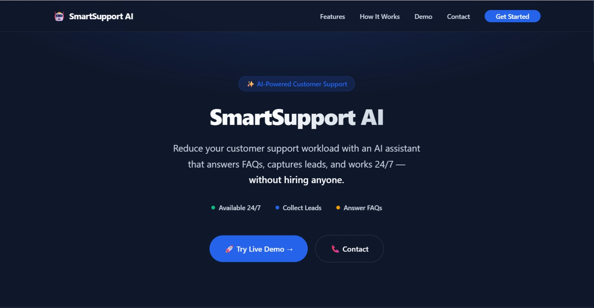
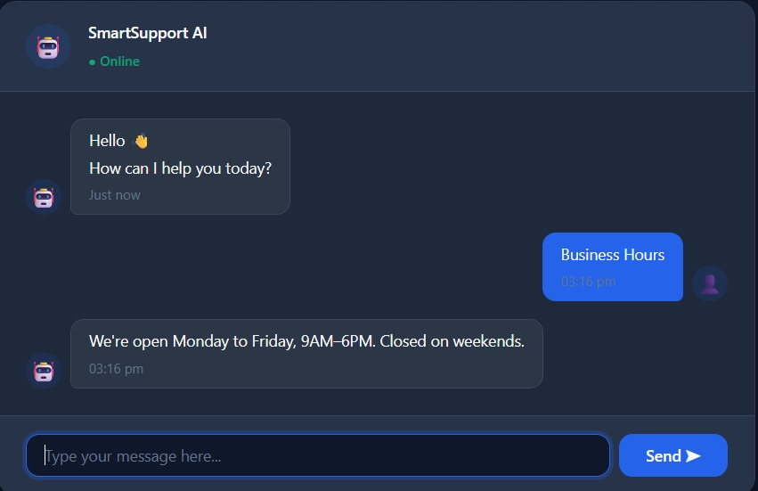
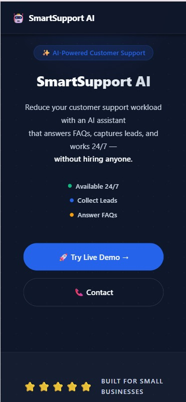

# 🤖 SmartSupport AI

<div align="center">

**AI-powered customer support chatbot for modern small businesses.**  
Answers FAQs instantly. Captures leads automatically. Works 24/7.

[](https://shivamr-hub.github.io/ai-faq-chatbot/)
[](https://developer.mozilla.org/en-US/docs/Web/HTML)
[](https://developer.mozilla.org/en-US/docs/Web/CSS)
[](https://developer.mozilla.org/en-US/docs/Web/JavaScript)
[](LICENSE)

</div>

---

## 📸 Screenshots

| Homepage | Chat Demo | Mobile View |
|---|---|---|
|  |  |  |

---

## 🎥 Demo Video

[](https://www.loom.com/share/YOUR_LOOM_LINK_HERE)

> 📌 **[Click to watch the 60-second demo →](https://www.loom.com/share/YOUR_LOOM_LINK_HERE)**  
> *(Replace this link with your actual Loom or YouTube URL)*

---

## 📌 What It Does

SmartSupport AI is a zero-dependency, browser-based chatbot that any small business can deploy in under an hour.

| Problem | Solution |
|---|---|
| Customers ask the same 10 questions every day | AI answers them instantly, 24/7 |
| Leads arrive outside business hours | Bot captures name, email, and phone automatically |
| Building a chatbot is expensive | This costs nothing to run — no monthly fees |
| Every client needs a custom setup | Edit one file (`faq-data.js`) — done |

---

## ✨ Features

- ⚡ **Instant FAQ responses** — keyword matching engine with confidence scoring
- 📈 **Lead capture flow** — 4-state conversation machine collects contact info
- 💾 **Persistent chat history** — localStorage saves the conversation across refreshes
- 📌 **Suggested questions** — one-click pill buttons for common queries
- ⌨️ **Typing indicator** — animated dots make the bot feel human
- 🎨 **Dark theme design** — glassmorphism, gradient text, smooth animations
- 📱 **Fully responsive** — works on mobile, tablet, and desktop
- 🔧 **One-file customization** — change business name, FAQs, contact in minutes

---

## 🖥️ Live Demo

👉 **[Try it here →](https://shivamr-hub.github.io/ai-faq-chatbot/)**

**Test these phrases in the chat:**
- `"hello"` → greeting response
- `"what are your hours?"` → FAQ match
- `"I need a quotation"` → lead capture starts
- Click a suggestion pill → instant answer

---

## 🛠️ Tech Stack

| Layer | Technology | Why |
|---|---|---|
| Structure | HTML5 (semantic) | `<header>`, `<nav>`, `<section>`, `<footer>` |
| Styling | CSS3 (custom, no framework) | Full design system — 9 sections, CSS variables only |
| Logic | Vanilla JavaScript (ES6+) | Classes, async/await, state machine |
| Storage | localStorage | No backend needed — fully client-side |
| Fonts | Inter (Google Fonts) | Industry-standard SaaS typography |
| Hosting | GitHub Pages / Netlify | Free, zero-config deployment |

---

## 🏗️ Architecture

```
app.js              ← Entry point — init, event binding, send flow
  ├── ui.js         ← All DOM rendering — messages, typing, pills
  ├── chatbot.js    ← Bot engine — keyword matching + lead state machine
  ├── faq-data.js   ← Business config — the only file a client edits
  ├── storage.js    ← localStorage — chat history, theme, leads
  └── utils.js      ← Pure helpers — normalize, validate, delay, score
```

**Dependency rule:** Each file only uses functions from files loaded before it.  
**No circular dependencies. No framework. No build step.**

See [`docs/architecture.md`](docs/architecture.md) for the full data flow diagram.

---

## 📁 Folder Structure

```
faq-chatbot/
├── index.html          ← Main page
├── css/
│   └── style.css       ← Design system (9 sections, CSS variables)
├── js/
│   ├── utils.js        ← Pure helpers
│   ├── storage.js      ← localStorage wrapper
│   ├── faq-data.js     ← 🔧 Client edits this
│   ├── ui.js           ← DOM rendering
│   ├── chatbot.js      ← Bot engine
│   └── app.js          ← Entry point
├── assets/             ← Images, icons
├── docs/
│   ├── architecture.md ← Module structure
│   ├── api.md          ← Function reference
│   ├── setup.md        ← Installation guide
│   ├── case-study.md   ← Full project breakdown
│   └── screenshots/    ← UI screenshots
├── README.md
├── CHANGELOG.md
├── LICENSE
└── .gitignore
```

---

## ⚙️ Installation

```bash
# Clone the repository
git clone https://github.com/shivamr-hub/ai-faq-chatbot.git
cd ai-faq-chatbot

# Open in VS Code
code .

# Run with Live Server (VS Code extension)
# Right-click index.html → Open with Live Server
```

No npm. No build. No setup beyond that.

---

## 🔧 Customizing for a Client

Open `js/faq-data.js` and update:

```javascript
const BUSINESS = {
  name:    "Your Client's Business",
  contact: { phone: "...", email: "...", address: "..." },
  hours:   { weekdays: "Mon–Sat", timing: "10AM–7PM" },
  faqs: [
    {
      keywords: ["hours", "open", "timing"],
      answer:   "We're open Monday to Saturday, 10AM to 7PM."
    },
    // Add more FAQs here...
  ]
};
```

**Total customization time: 15–30 minutes.**  
Everything else — UI, animations, logic — adapts automatically.

---

## 💡 Lead Capture Flow

```
User: "I need a quotation"
  ↓  (lead trigger detected)
Bot: "I'd love to help! What's your name?"
  ↓
Bot: "Nice to meet you, [Name]! What's your email?"
  ↓  (email validated with regex)
Bot: "And your phone number?"
  ↓  (10-digit Indian mobile validated)
Bot: "Thank you! Our team will contact you shortly."
  ↓
Lead saved to localStorage → ready for export
```

---

## 🗺️ Roadmap

| Feature | Version | Status |
|---|---|---|
| FAQ keyword matching | v1.0 | ✅ Done |
| Lead capture state machine | v1.0 | ✅ Done |
| Chat history persistence | v1.0 | ✅ Done |
| Suggested questions | v1.0 | ✅ Done |
| Typing indicator | v1.0 | ✅ Done |
| Dark / Light theme toggle | v1.1 | 🔜 Next |
| Admin panel — view leads | v1.1 | 🔜 Next |
| CSV lead export | v1.2 | ⏳ Planned |
| OpenAI API integration | v2.0 | ⏳ Planned |
| Embeddable widget script | v2.0 | ⏳ Planned |

---

## 💼 Service Packages

Available for client deployment:

| Package | Includes | Price |
|---|---|---|
| **Basic** | FAQ Chatbot, up to 15 FAQs | ₹2,999 |
| **Standard** | FAQ + Lead Capture + Business Hours | ₹5,999 |
| **Premium** | Standard + Website Integration + 3 months support | ₹9,999 |

📧 **Interested?** → hello@smartsupport.ai

---

## 📄 License

This project is licensed under the [MIT License](LICENSE).

---

## 👤 Author

**Shivam** — AI Automation & Web Development  
Building AI tools for Indian small businesses.

[](https://github.com/shivamr-hub)

---

<div align="center">
  <sub>Built with intention, not just code.</sub>
</div>
